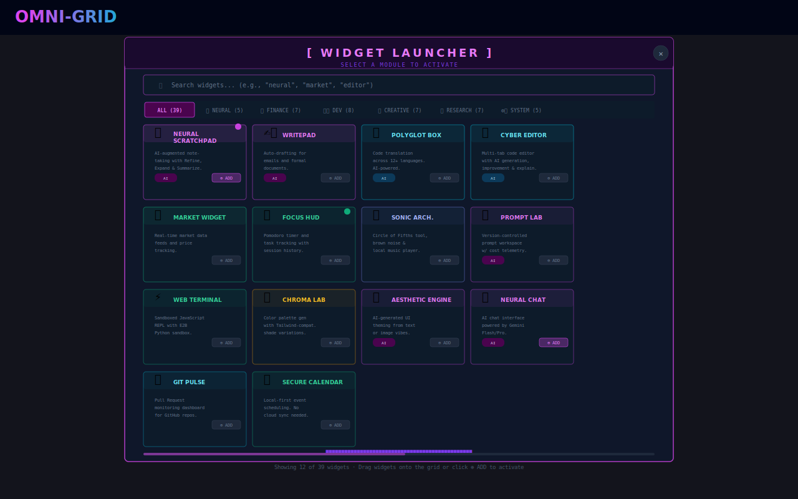
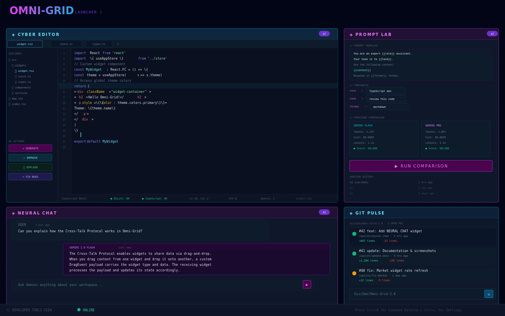
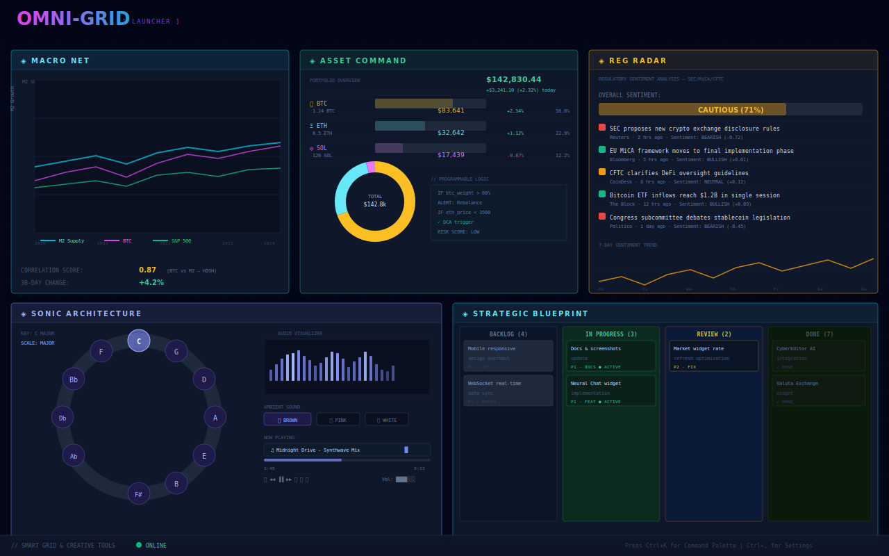

# OMNI-GRID DOCUMENTATION

```text
   ____  __  __ _   _ ___       ____ ____  ___ ____
  / __ \|  \/  | \ | |_ _|     / ___|  _ \|_ _|  _ \
 | |  | | |\/| |  \| || |_____| |  _| |_) || || | | |
 | |__| | |  | | |\  || |_____| |_| |  _ < | || |_| |
  \____/|_|  |_|_| \_|___|     \____|_| \_\___|____/

  [ DOCUMENTATION PORTAL ]
```

## 📚 COMPLETE DOCUMENTATION INDEX

Welcome! This is your gateway to comprehensive Omni-Grid documentation.

---

## 🖼️ SCREENSHOTS

<div align="center">

|                   Dashboard Overview                    |                      Widget Launcher                       |
| :-----------------------------------------------------: | :--------------------------------------------------------: |
|  |  |
|          _Main dashboard with active widgets_           |              _Browse and activate 42 modules_              |

|                      Developer Tools                       |                   Smart Grid & Creative                   |
| :--------------------------------------------------------: | :-------------------------------------------------------: |
|  |  |
|     _CyberEditor, Prompt Lab, Neural Chat, Git Pulse_      | _Macro Net, Asset Command, Reg Radar, Sonic Architecture_ |

</div>

---

## 🚀 GETTING STARTED

New to Omni-Grid? Start here:

1. **[Getting Started Guide](./docs/getting-started.md)**
   - Installation and setup
   - First launch walkthrough
   - Essential operations
   - Quick start tutorials

2. **[Configuration Guide](./docs/configuration.md)**
   - Environment variables
   - API key setup
   - Theme customization
   - Performance tuning

3. **[Development Roadmap](./ROADMAP.md)**
   - Project timeline and milestones
   - Current sprint status
   - Upcoming features
   - Contribution opportunities

4. **[Project Blueprint](./PROJECT_BLUEPRINT.md)**
   - Detailed task breakdown and implementation plans
   - Technical specifications for each feature
   - Sprint planning and dependencies
   - Testing and success criteria

---

## 📖 USER GUIDES

For end users of Omni-Grid:

- **[FAQ](./docs/faq.md)** - Quick answers to common questions
- **[Troubleshooting](./docs/troubleshooting.md)** - Solve common issues
- **[Keyboard Shortcuts](./docs/keyboard-shortcuts.md)** - Boost your productivity
- **[WIKI - Knowledge Base](./docs/WIKI.md)** - Core concepts and philosophy

---

## 🔧 DEVELOPER GUIDES

For developers building on Omni-Grid:

- **[Architecture Overview](./docs/architecture.md)** - System design and technical decisions
- **[Widget Development](./docs/widget-development.md)** - Create custom widgets
- **[API Reference](./docs/api-reference.md)** - Complete API documentation
- **[State Management](./docs/state-management.md)** - Zustand patterns and best practices
- **[How-To Guide](./docs/HOWTO.md)** - Practical recipes and code examples

---

## 🎯 BY TOPIC

### Installation & Setup

- [Getting Started → Prerequisites](./docs/getting-started.md#prerequisites)
- [Getting Started → Installation](./docs/getting-started.md#installation)
- [Configuration → Environment Variables](./docs/configuration.md#environment-variables)

### Using Omni-Grid

- [Getting Started → First Launch](./docs/getting-started.md#first-launch)
- [Getting Started → Essential Operations](./docs/getting-started.md#essential-operations)
- [Keyboard Shortcuts → Global Shortcuts](./docs/keyboard-shortcuts.md#global-shortcuts)
- [FAQ → Usage Questions](./docs/faq.md#usage-questions)

### Customization

- [Configuration → Theme Configuration](./docs/configuration.md#theme-configuration)
- [Configuration → Layout Configuration](./docs/configuration.md#layout-configuration)
- [WIKI → Aesthetic Engine Philosophy](./docs/WIKI.md#7-aesthetic-engine-philosophy)

### Development

- [Widget Development → Complete Workflow](./docs/widget-development.md#widget-creation-workflow)
- [Architecture → Core Components](./docs/architecture.md#core-components)
- [API Reference → State Management](./docs/api-reference.md#state-management)
- [State Management → Usage Patterns](./docs/state-management.md#usage-patterns)

### AI Features

- [WIKI → Neural Link](./docs/WIKI.md#2-neural-link-ai-integration)
- [FAQ → AI Questions](./docs/faq.md#ai-questions)
- [Configuration → API Configuration](./docs/configuration.md#api-configuration)

### Troubleshooting

- [Troubleshooting → Common Issues](./docs/troubleshooting.md#common-issues)
- [FAQ → Technical Questions](./docs/faq.md#technical-questions)
- [Troubleshooting → Debugging Techniques](./docs/troubleshooting.md#debugging-techniques)

### Project Planning

- [Roadmap → Milestone Timeline](./ROADMAP.md#milestone-timeline)
- [Roadmap → Current Sprint](./ROADMAP.md#current-sprint-q2-2026)
- [Roadmap → Contribution Opportunities](./ROADMAP.md#contribution-opportunities)
- [Roadmap → Technical Milestones](./ROADMAP.md#technical-milestones)

---

## 📊 DOCUMENTATION STATS

- **Total Documentation Files:** 13
- **Total Lines:** ~23,400
- **Topics Covered:** 100+
- **Roadmap Phases:** 5
- **Widgets Documented:** 42 (all widgets)
- **Code Examples:** 150+
- **Last Updated:** April 2026

---

## 🎓 RECOMMENDED READING PATHS

### For New Users

1. [Getting Started Guide](./docs/getting-started.md)
2. [FAQ](./docs/faq.md)
3. [Keyboard Shortcuts](./docs/keyboard-shortcuts.md)
4. [Configuration Guide](./docs/configuration.md)

### For Developers

1. [Architecture Overview](./docs/architecture.md)
2. [Widget Development Guide](./docs/widget-development.md)
3. [API Reference](./docs/api-reference.md)
4. [State Management Guide](./docs/state-management.md)

### For Contributors

1. [CONTRIBUTING.md](./CONTRIBUTING.md)
2. [Architecture Overview](./docs/architecture.md)
3. [Widget Development Guide](./docs/widget-development.md)
4. [How-To Guide](./docs/HOWTO.md)

### Deep Dives

1. [WIKI - Knowledge Base](./docs/WIKI.md)
2. [Architecture → System Blueprint](./docs/architecture.md)
3. [State Management → Advanced Patterns](./docs/state-management.md)

---

## 🔍 SEARCH TIPS

**In GitHub:**

- Use the search bar with `path:docs/ <your query>`
- Example: `path:docs/ widget development`

**In Your Editor:**

- Open `docs/` folder
- Use Find in Files (Cmd+Shift+F or Ctrl+Shift+F)
- Search across all markdown files

**In Browser:**

- Open any documentation file on GitHub
- Use Cmd+F (Mac) or Ctrl+F (Windows) to search within page

---

## 🆘 NEED HELP?

Can't find what you're looking for?

1. **Check the [FAQ](./docs/faq.md)** - Most common questions answered
2. **Browse the [Documentation Hub](./docs/README.md)** - Complete index
3. **Search [GitHub Issues](https://github.com/GizzZmo/Omni-Grid-2.0/issues)** - Someone may have asked
4. **Open a [New Issue](https://github.com/GizzZmo/Omni-Grid-2.0/issues/new)** - We'll help you out

---

## 🤝 CONTRIBUTING TO DOCUMENTATION

Found an error or want to improve the docs?

1. Fork the repository
2. Edit the relevant `.md` file in `docs/`
3. Submit a Pull Request
4. Tag with `documentation` label

**Documentation Guidelines:**

- Use clear, concise language
- Include code examples where helpful
- Follow existing formatting style
- Test all links before submitting

---

## 📝 DOCUMENTATION STRUCTURE

```
docs/
├── README.md                 # Documentation hub
├── getting-started.md        # Installation & first steps
├── configuration.md          # Settings & customization
├── architecture.md           # Technical deep-dive
├── widget-development.md     # Building widgets
├── api-reference.md          # Complete API
├── state-management.md       # Zustand patterns
├── keyboard-shortcuts.md     # Shortcuts reference
├── troubleshooting.md        # Common issues
├── faq.md                    # Quick answers
├── WIKI.md                   # Core concepts
└── HOWTO.md                  # Practical recipes
```

---

---

## 🎵 SUNO AI INTEGRATION

Omni-Grid 2.0 includes an official Suno AI generated theme song and three integration points:

| Widget                 | Integration                                                                                       |
| ---------------------- | ------------------------------------------------------------------------------------------------- |
| **Suno Player**        | Dedicated widget — native HTML5 audio, seek bar, volume, cover art, and embedded Suno iframe view |
| **Sonic Architecture** | ⚡ Demo button loads the theme directly into the playlist player                                  |
| **Signal Radio**       | ⚡ Omni-Grid Theme preset station plays the track via the Suno CDN                                |

### Official Theme

- **Song:** Omni-Grid 2.0 — Official Theme
- **Artist:** Omni-Grid AI (Suno)
- **URL:** [https://suno.com/song/652af4a0-378e-4967-a762-09b9ed7ac9fb](https://suno.com/song/652af4a0-378e-4967-a762-09b9ed7ac9fb)
- **Tags:** `cyberpunk`, `synthwave`, `AI-generated`

### Using the Suno Player

1. Open the **Widget Launcher** (grid icon in the dock)
2. Find and activate **Suno Player**
3. Use the **Player tab** for native HTML5 audio with seek/volume controls
4. Use the **Suno Embed tab** to view the full Suno song page in-widget

## 📚 EXTERNAL RESOURCES

- **GitHub Repository:** [GizzZmo/Omni-Grid-2.0](https://github.com/GizzZmo/Omni-Grid-2.0)
- **React Documentation:** [react.dev](https://react.dev)
- **Zustand Documentation:** [github.com/pmndrs/zustand](https://github.com/pmndrs/zustand)
- **TailwindCSS:** [tailwindcss.com](https://tailwindcss.com)
- **Lucide Icons:** [lucide.dev](https://lucide.dev)

---

_"The net is vast and infinite, but your grid is your own."_

**Documentation Version:** 2.1  
**Last Updated:** April 2026  
**Maintained by:** Jon-Arve Constantine / GizzZmo
